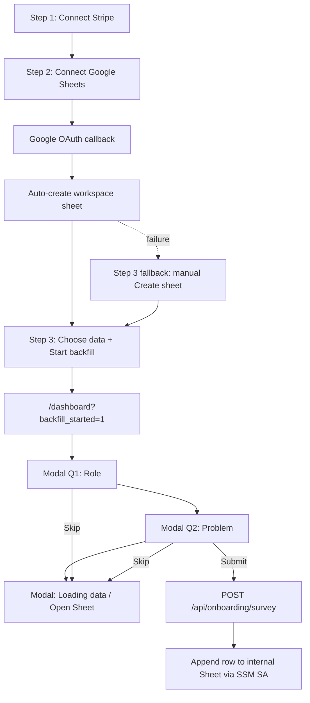

# Onboarding Redesign (Design B)

Branch: `bp-1231-onboard-survey`

This document records the product/UX decisions and the code changes for consolidating onboarding and adding a post-activation micro-survey.

## Goals

1. **Reduce friction** — fewer steps and clicks before users reach value (Stripe data syncing).
2. **Gather intent** — optional role + “what problem are you solving” answers for audience mining.
3. **Minimize annoyance** — survey appears after activation, during the natural backfill wait; skippable; single-click chips.

## Design chosen: Design B (balanced)

Among three options considered, **Design B** was selected:

- Collapse the technical setup from **4 steps → 3** (remove the manual “Create sheet” click).
- Collect survey answers **after** “Start backfill & sync”, not before connecting Stripe.
- Use a **modal** on the dashboard (extend `BackfillIntroModal`), not a separate `/onboarding/personalize` route.
- Questions are **optional/skippable**, with **chip selectors** and an “Other” free-text fallback.
- Answers persist to an **internal Google Sheet** only — **not** Amplitude user properties or event payloads with answer values.

## Key decisions

| Topic | Decision | Rationale |
|-------|----------|-----------|
| Survey timing | Post-activation, during backfill wait | User has already converted; zero added time-to-value friction |
| Required vs optional | Optional, prominent Skip | Maximizes completion without blocking dashboard access |
| Input style | Single-click chips + Other | Faster than free-text; higher completion than open fields |
| Survey UI | 3-step modal (Q1 → Q2 → confirmation) | Reuses existing `?backfill_started=1` trigger; dashboard visible behind modal |
| Sheet creation | Auto-create on Google OAuth callback | Step 3 was a no-input click; removing it saves one interaction |
| Answer storage | Internal company Google Sheet | One row per response; easy to review and mine; not scattered in user workspaces |
| Sheet auth | Reuse reporting service account via **AWS SSM** | Matches `asv2-serverless` convention; no SA JSON in env vars |
| Analytics | No survey answers in Amplitude | User request; Google Sheet is sole durable store for role/problem |

## User flow (after)



## Part 1 — 3-step onboarding

### Behavior

| Step | Before | After |
|------|--------|-------|
| 1 | Connect Stripe | Unchanged |
| 2 | Connect Google Sheets | Unchanged; copy notes sheet is auto-created after OAuth |
| 3 | Create workspace sheet (manual click) | **Removed** — sheet created server-side in callback |
| 4 | Choose data + start trial | **Renumbered to step 3** |

If auto-create fails, step 3 shows a **“Create sheet”** fallback (same `POST /api/google/create-sheet` as before) with `?sheetError=1` messaging.

### Files changed

| File | Change |
|------|--------|
| `app/api/google/callback/route.ts` | After `putGoogleConnection`, calls `createWorkspaceSheetAndConfig` for `google-connect` flow; redirects to `?step=3` or `?step=3&sheetError=1` |
| `components/onboarding/onboarding-wizard.tsx` | 3-step `steps` array; `needsSheetCreation` fallback on step 3; updated handlers and progress copy |
| `app/(marketing)/stripe-app/start/page.tsx` | `connections_linked` and `sheet_created` → `/onboarding?step=3` |
| `components/dashboard/dashboard.tsx` | `getNextOnboardingStep()` maps both linked/sheet-created stages → step 3 |
| `app/api/google/connect/route.ts` | Already used `returnTo: /onboarding?step=3` (unchanged) |

`onboardingStage` in `lib/app-state/user-state.ts` is **unchanged** — still derived from DynamoDB connections + sync configs.

## Part 2 — Post-activation micro-survey (modal)

### Behavior

Triggered when the user lands on `/dashboard?backfill_started=1` (unchanged from pre-redesign).

`BackfillIntroModal` is now a **3-card flow**:

1. **Q1** — “What best describes your role?” (chips from `lib/onboarding/survey-options.ts`)
2. **Q2** — “What problem are you trying to solve with SyncStaq?”
3. **Confirmation** — existing “We’re loading your Stripe data…” + Open Google Sheet / Got it

- **Skip** on Q1 or Q2 jumps to the confirmation card.
- **Backdrop click** does not dismiss during Q1/Q2; allowed on confirmation.
- **Submit** on Q2 fire-and-forgets to `POST /api/onboarding/survey` (never blocks UI).

### Backfill auto-close (dashboard)

Polling (`POLL_INTERVAL_MS` / `POLL_MAX_MS`) is **unchanged** — it still drives the live “Backfilling” badge and completion analytics.

The modal auto-close effect was tightened:

- Track `surveyStep` (`q1` | `q2` | `done`) via `onSurveyStepChange`.
- **Do not** auto-close while on `q1` or `q2` (fast backfills won’t yank the modal mid-answer).
- Auto-close on the **confirmation** card only when backfill transitions running → done (falling edge), not on a steady `!hasBackfillRunning`.

### Files changed

| File | Change |
|------|--------|
| `components/dashboard/backfill-intro-modal.tsx` | Survey UI, chip grid, progress dots, 3-step state machine |
| `components/dashboard/dashboard.tsx` | `surveyStep` state; revised auto-close effect; passes `onSurveyStepChange` |
| `lib/onboarding/survey-options.ts` | **New** — role/problem chip options and types |

## Part 3 — Persist answers (Google Sheet via SSM)

### Storage

- **Destination:** one internal “Survey Responses” Google Sheet (not the user’s workspace sheet).
- **Row columns:** `timestamp`, `userId`, `email`, `role`, `problem`, `roleOther`, `problemOther`.

### SSM parameters (dev and prod)

| Parameter | Type | Notes |
|-----------|------|--------|
| `/${project}/${stage}/google-service-account/reporting-sheet-writer` | SecureString | **Reused** existing reporting SA JSON |
| `/${project}/${stage}/survey/responses-sheet-id` | String | Spreadsheet ID for survey responses |

### Web app env vars (names only — not secrets)

```bash
SURVEY_SERVICE_ACCOUNT_PARAM_NAME=/${project}/${stage}/google-service-account/reporting-sheet-writer
SURVEY_RESPONSES_SHEET_ID_PARAM_NAME=/${project}/${stage}/survey/responses-sheet-id
```

Local dev skips the Sheets write unless `WRITE_SURVEY_RESPONSES=1` (mirrors `SEND_EMAILS` for column requests).

### Files added/changed

| File | Change |
|------|--------|
| `lib/aws/ssm.ts` | **New** — `getSsmParameter()` with in-memory cache |
| `lib/google/survey-responses-sheet.ts` | **New** — JWT auth + `spreadsheets.values.append` |
| `app/api/onboarding/survey/route.ts` | **New** — auth, rate limit, validation, append |
| `package.json` | Added `@aws-sdk/client-ssm` |
| `README.md` | SSM setup and one-time ops instructions |

### Infra (`asv2-serverless`)

| File | Change |
|------|--------|
| `lib/app-stack.ts` | `surveyResponsesSheetIdParamName`; web app IAM user `ssm:GetParameter` + `kms:Decrypt` for survey SA + sheet-id params |

## One-time ops (before survey writes work)

1. Create the responses Google Sheet with the header row above.
2. Share it with the **reporting service-account** email (`client_email` from the SSM JSON) as Editor.
3. Create SSM String param `/${project}/${stage}/survey/responses-sheet-id` with the spreadsheet ID.
4. Set `SURVEY_*_PARAM_NAME` env vars on the web app host.
5. Deploy `asv2-serverless` so the web app IAM user has SSM read access.

## Deviations from the original design doc

The attached planning doc described a separate `/onboarding/personalize` page, env-var SA credentials, and Amplitude persistence. The implemented version differs as above per follow-up decisions:

- **Modal** instead of dedicated survey page.
- **SSM** instead of `SURVEY_SERVICE_ACCOUNT_JSON` env vars.
- **No Amplitude** storage of survey answer values.

## Out of scope (future)

- `UserProfileSchema` fields for role/use case in DynamoDB.
- Conditional onboarding or dashboard personalization based on survey answers.
- Content-free funnel events (“Survey Completed” / “Skipped”) in Amplitude.
